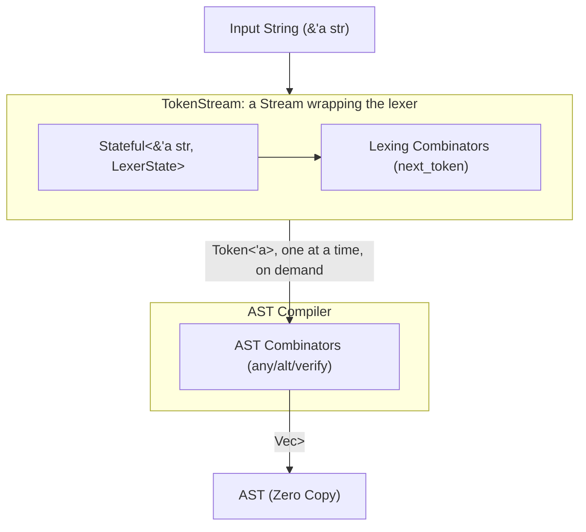
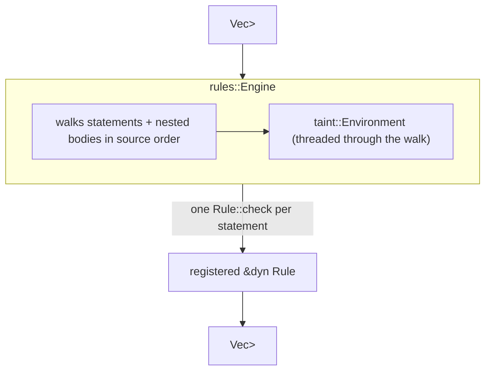
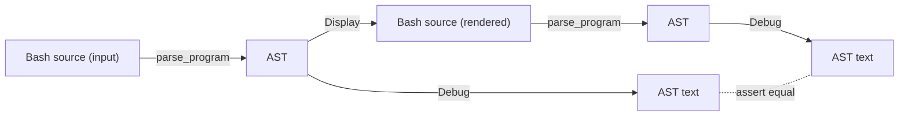

# Architecture Design: Zero-Copy Context-Aware Bash Parser

## 1. Executive Summary

Parsing Bash correctly requires handling highly context-sensitive grammar (e.g., distinguishing when `for` is a keyword vs. a string literal, arithmetic contexts, and heredocs). A pure scannerless parser results in excessive backtracking and unmaintainable code.

This document proposes a **Hybrid-Lexing Architecture** using the `winnow` parser combinator library in Rust. By strictly decoupling context-aware tokenization from structural AST compilation, we achieve an ultra-fast, strictly zero-copy pipeline that seamlessly aligns with `inceptool-rs` compiler policies.

## 2. Core Architecture Pipeline

Lexing and parsing are fused into a single pass: the AST compiler pulls one token at a time from the lexer through a custom `winnow::stream::Stream` implementation, rather than the lexer first draining the entire input into a `Vec<Token>` for the parser to consume afterward.



## 3. Phase 1: Context-Aware Lexer

The Lexer consumes raw strings and yields an array of `Token<'a>`. Because of Bash's context rules, the Lexer must be stateful.

### 3.1. Lexer State Definition

We utilize `winnow::stream::Stateful` to thread a mutable context through the tokenization stream.

```rust
use std::borrow::Cow;
use winnow::stream::Stateful;

/// Tracks the current parsing context of the Bash script
#[derive(Debug, Clone, Default)]
pub struct LexerState {
    pub in_arithmetic: bool,
    pub heredoc_delimiter: Option<String>,
    pub command_position: bool, // True if the next token is expected to be a command/keyword
}

/// The stateful input stream type for the lexer
pub type LexerStream<'a> = Stateful<&'a str, LexerState>;
```

### 3.2. Token Representation

Following `inceptool-rs` `GEMINI.md` rules, strings must utilize `Cow<'a, str>` only when unescaping is required, defaulting to `&'a str` for zero-allocation.

```rust
#[derive(Debug, Clone, PartialEq)]
pub enum Token<'a> {
    KeywordFor,
    KeywordIn,
    Identifier(&'a str),
    Operator(&'a str),
    /// Zero-copy by default; allocates only if escape sequences (\n, \") are evaluated
    StringLiteral(Cow<'a, str>), 
    Eof,
}
```

### 3.3. Contextual Branching

The lexer functions use the `.state` property to dynamically select logic without performance penalties.

```rust
use winnow::ModalResult;
use winnow::token::take_while;
use winnow::combinator::preceded;
use winnow::Parser;

#[must_use = "constructs the identifier token; failure to use drops the parsed stream state"]
fn parse_variable<'a>(input: &mut LexerStream<'a>) -> ModalResult<Token<'a>> {
    let name = if input.state.in_arithmetic {
        take_while(1.., ('a'..='z', 'A'..='Z', '_')).parse_next(input)?
    } else {
        preceded('$', take_while(1.., ('a'..='z', 'A'..='Z', '_'))).parse_next(input)?
    };
    
    Ok(Token::Identifier(name))
}
```

## 4. AST Compilation

The AST compiler does not deal with raw strings or a pre-lexed buffer; it drives the lexer directly through a `Stream` implementation and parses the tokens it produces.

### 4.1. The TokenStream

`TokenStream<'a>` wraps the lexer's `Stateful<&'a str, LexerState>` and implements `winnow::stream::Stream` by hand, so every `any`/`verify`/`alt` call in the parser triggers exactly one lexer step on demand. Backtracking (`Verify`, `Alt`) falls out for free: `Stream::checkpoint`/`reset` just clone/restore the whole `TokenStream`, since both the underlying `&str` position and the (currently inert) `LexerState` are cheap to clone.

```rust
pub struct TokenStream<'a> {
    lexer: LexerStream<'a>,
    lex_failure: Option<LexerStream<'a>>,
}

impl<'a> Stream for TokenStream<'a> {
    type Token = Token<'a>;
    // ...

    fn next_token(&mut self) -> Option<Self::Token> {
        match next_token(&mut self.lexer) {
            Ok(Token::Eof) => None,
            Ok(token) => Some(token),
            Err(_) => {
                self.lex_failure = Some(self.lexer.clone());
                None
            }
        }
    }
    // ...
}

pub type ParserStream<'a> = TokenStream<'a>;
```

`Stream::next_token` returns `Option<Token>`, with no slot for an error, so a genuine lex failure (e.g. an unhandled whitespace byte) is reported to the parser as ordinary end-of-stream. `TokenStream` snapshots the lexer state at the failure point so that `take_lex_error()` can re-lex that single token afterward and recover the real, specific error — rather than letting the parser's generic "ran out of tokens" error mask the actual cause.

### 4.2. Structural AST Definition

The final AST continues to hold references to the original `&'a str`, ensuring zero memory movement.

```rust
#[derive(Debug, Clone, PartialEq)]
pub enum Expr<'a> {
    Literal(Cow<'a, str>),
    VarRef(&'a str),
    /// A word mixing literal text and `$NAME`/`${NAME}` references, e.g.
    /// `"prefix${x}suffix"` is `[Literal("prefix"), VarRef("x"), Literal("suffix")]`.
    Interpolated(Vec<Self>),
}

#[derive(Debug, Clone, PartialEq)]
pub enum Statement<'a> {
    Command {
        name: &'a str,
        args: Vec<Expr<'a>>,
    },
    ForLoop {
        variable: &'a str,
        iterable: Vec<Expr<'a>>,
        body: Vec<Statement<'a>>,
    }
    // ...If/While/Until/Pipeline/Subshell/BraceGroup/List/Redirected, see `types.rs`
}
```

`Expr::Interpolated` is produced by the parser, not derived later by an analysis pass — see
§7 for why that matters once taint analysis needs to walk these words.

### 4.3. AST Combinators

We use standard combinators over our custom tokens. Since `Token` derives `PartialEq`, `winnow::token::any` combined with `verify` provides ergonomic token extraction.

```rust
use winnow::token::any;

#[must_use = "parses a loop statement; discarding ignores syntax structures"]
fn parse_for_loop<'a>(input: &mut ParserStream<'a>) -> ModalResult<Statement<'a>> {
    // 1. Match Keyword
    let _ = any.verify(|t| matches!(t, Token::KeywordFor)).parse_next(input)?;
    
    // 2. Extract specific token payload
    let variable = any.verify_map(|t| match t {
        Token::Identifier(name) => Some(*name),
        _ => None,
    }).parse_next(input)?;
    
    // 3. Match Keyword
    let _ = any.verify(|t| matches!(t, Token::KeywordIn)).parse_next(input)?;
    
    // ... parse the block ...
    
    Ok(Statement::ForLoop {
        variable,
        iterable: vec![],
        body: vec![],
    })
}
```

## 5. Error Handling Compliance

According to project policy, custom typed errors must be used via `thiserror` for library crates, avoiding `anyhow`.

```rust
#[derive(thiserror::Error, Debug)]
pub enum ParseError<'a> {
    #[error("Lexical error at byte offset {offset}")]
    Lexer {
        offset: usize,
    },
    #[error("Syntax error: expected {expected}, found {found:?}")]
    Syntax {
        expected: &'static str,
        found: Option<Token<'a>>,
    }
}
```

*(Note: `winnow::ModalResult` provides highly optimized built-in error variants that can be seamlessly mapped into our custom `ParseError` at the pipeline boundaries).*

## 6. Pipeline Orchestration

`lib.rs` composes the fused stream and the parser behind two public entry points: `parse_program`, which returns the structured `Vec<Statement<'_>>`, and `render_program_ast`, a thin wrapper that renders it to the `{:?}`-debug text corpus tests compare against. The split exists because the AST itself — not its rendered text — is what the taint analysis and rule engine in §7 need to consume; `render_program_ast` remains for corpus tests and is no longer the only way out of the parser. There is no separate "tokenize the whole input" pass either way — lexing and parsing happen lazily, interleaved, as `parse_statements` runs.

```rust
fn parse_statements<'a>(stream: &mut TokenStream<'a>) -> ModalResult<Vec<Statement<'a>>> {
    let mut statements = Vec::new();

    while stream.peek_token().is_some() {
        statements.push(parse_statement(stream)?);
    }

    Ok(statements)
}

fn render_statements(statements: &[Statement<'_>]) -> String { /* ... */ }

pub fn parse_program(input: &str) -> ModalResult<Vec<Statement<'_>>> {
    let mut stream = TokenStream::new(input);
    let parsed = parse_statements(&mut stream);

    if let Some(lex_error) = stream.take_lex_error() {
        return Err(lex_error);
    }

    parsed
}

pub fn render_program_ast(input: &str) -> ModalResult<String> {
    Ok(render_statements(&parse_program(input)?))
}
```

After `parse_statements` returns, `take_lex_error()` is checked first and overrides the result if present: a stored lex failure means the parser silently treated unlexable input as end-of-stream, so neither an `Ok` nor a generic `Err` from `parse_statements` can be trusted over the real root cause.

## 7. Taint Analysis & Lint Rules

Beyond parsing, `parable` ships a flow-insensitive taint analysis (`taint.rs`) and a rule engine
built on top of it (`rules.rs`), aimed at catching the canonical shell-injection shape: a value
influenced by the script's caller reaching a dangerous sink like `eval`.



### 7.1. Symbolic Values

`taint::Environment` tracks each Bash variable's `SymbolicValue` in a `BTreeMap`, updated as the
engine walks statements in source order:

```rust
pub enum SymbolicValue {
    Constant(String),
    Tainted(TaintSource),   // e.g. $1, $@, $*, $# — caller-supplied
    Concat(Vec<Self>),      // tainted if any part is
    Unknown,                // command substitution, unrecognized expansion, ...
}
```

`Environment::resolve_expr` walks an `Expr`, including `Expr::Interpolated` (§4.2) — so taint
propagates through `"prefix-$1-suffix"` without the analysis needing its own copy of the
`$NAME` splitting logic the parser already did. The one place taint analysis still does its own
splitting is `apply_statement`'s handling of `NAME=value` assignments: the lexer has no notion
of assignment words, so `x=$1` arrives as a single opaque `Token::Word` command name rather than
something `parse_literal` ever interpolates. `apply_statement` calls `interpolation_segments`
(promoted to `pub(crate)` in `parser.rs` for this purpose) directly on that raw text instead of
walking an `Expr` that was never built.

### 7.2. Rule Engine

`rules::Engine` owns the recursive walk into `if`/`for`/`while`/`until`/pipeline/subshell/brace-
group/list bodies — a `Rule` only ever sees one `Statement` at a time, plus the `Environment` as
of just before that statement executes, and pattern-matches the shapes it cares about:

```rust
pub trait Rule {
    fn id(&self) -> &'static str;
    fn check<'a>(&self, stmt: &Statement<'a>, env: &Environment, findings: &mut Vec<Finding<'a>>);
}
```

The one rule shipped today, `TaintedDangerousCommand`, flags `eval`/`source`/`.` (the dot
command) when any argument resolves to a tainted `SymbolicValue`. `Finding`'s `detail` is a
structured `FindingDetail` enum rather than a pre-formatted string, per this crate's `newtype`
style policy — `Finding`'s `Display` impl is the single place that turns a finding into text.

## 8. Corpus-Driven Testing & Round-Trip Verification

`build.rs` reads every `corpus/*.tests` file (blocks of `=== description`, input, `---`, expected, `---`) and generates, for each file, **two** `rstest` functions rather than one:

1. **`{file_stem}`** — parses `input` and checks its `Debug` rendering (the AST's S-expression text form, e.g. `(command (word "echo"))`) against the corpus' `expected` text. This is the original AST-shape regression test.
2. **`{file_stem}_roundtrip`** — parses `input`, renders the resulting `Vec<Statement>` back to Bash source via `Display`, re-parses that rendered source, and asserts the re-parsed AST's `Debug` rendering matches the original AST's `Debug` rendering.



`Debug` and `Display` are deliberately kept separate per `Statement`/`Expr`: `Debug` is the canonical, fully-parenthesized AST dump used to pin down parser output in corpus tests; `Display` is the inverse — it regenerates valid Bash source from the AST. The round-trip test exists to keep these two renderings honest against each other: if `Display` ever drops or misrenders information that `Debug` shows the parser captured, re-parsing the `Display` output will produce a different AST and the `_roundtrip` case fails, even though the original `{file_stem}` case still passes.

Both generated functions share the same parsed `CorpusCase { ident, input, expected }` data (`parse_cases` in `build.rs`); the AST test uses `input` and `expected`, the round-trip test uses only `input`.

*(Redirects (`<`, `>`, `>>`, `>|`, `<>`, `<&`, `>&`, `&>`, `&>>`, `<<<`) are modeled via
`Statement::Redirected` and round-trip correctly. Remaining gap: heredocs (`<<`, `<<-`) aren't
parsed at all yet — capturing their body needs the lexer to switch into a line-scanning mode
keyed off the delimiter word, which doesn't exist yet.)*

## 9. Summary of Benefits

1. **Zero-Cost Abstractions**: The entire pipeline shifts pointers (`&str`, one `Token` at a time). No `Vec<Token>` buffer is ever materialized — tokens are produced exactly when the parser asks for them — and no strings are cloned unless escapes force unescaping into a `Cow::Owned`.
2. **Context Segregation**: All messy Bash edge cases reside strictly within `LexerState` and the lexer combinators. The AST compiler strictly builds tree structures.
3. **Optimized Error Paths**: Uses `ModalResult` natively throughout. Failure of a token match fails instantly without allocations, allowing `alt()` trees to navigate the grammar at extreme speeds.
