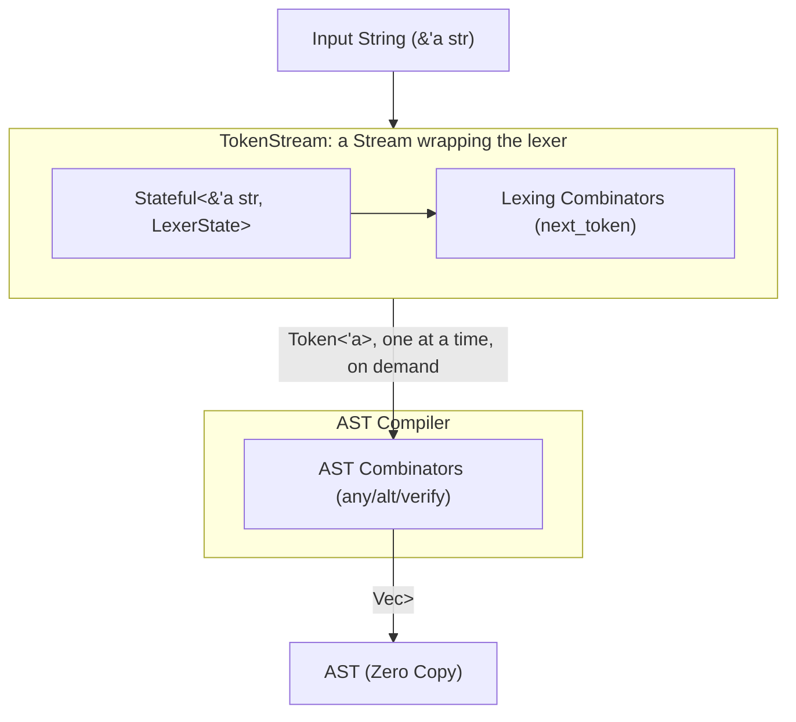
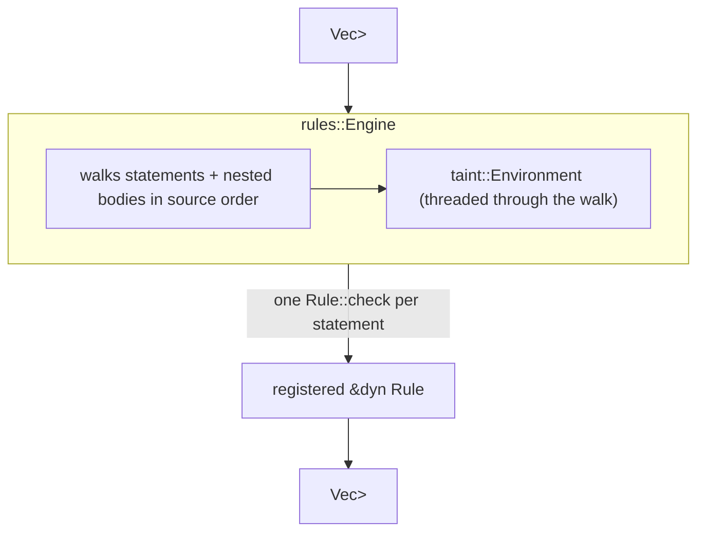
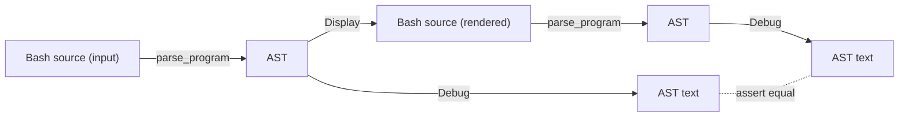

# Architecture Design: Zero-Copy Context-Aware Bash Parser

## 1. Executive Summary

Parsing Bash correctly requires handling highly context-sensitive grammar (e.g., distinguishing when `for` is a keyword vs. a string literal, arithmetic contexts, and heredocs). A pure scannerless parser results in excessive backtracking and unmaintainable code.

This document proposes a **Hybrid-Lexing Architecture** using the `winnow` parser combinator library in Rust. By strictly decoupling context-aware tokenization from structural AST compilation, we achieve an ultra-fast, strictly zero-copy pipeline that seamlessly aligns with `inceptool-rs` compiler policies.

## 2. Core Architecture Pipeline

Lexing and parsing are fused into a single pass: the AST compiler pulls one token at a time from the lexer through a custom `winnow::stream::Stream` implementation, rather than the lexer first draining the entire input into a `Vec<Token>` for the parser to consume afterward.



## 3. Phase 1: Context-Aware Lexer

The Lexer consumes raw strings and yields an array of `Token<'a>`. Because of Bash's context rules, the Lexer must be stateful.

### 3.1. Lexer State Definition

We utilize `winnow::stream::Stateful` to thread a mutable context through the tokenization stream.

```rust
/// Tracks the current parsing context of the Bash script
#[derive(Debug, Clone, Copy, Default)]
pub struct LexerState {
    pub in_arithmetic: bool,
    /// Bytes of already-captured heredoc body (see §3.3) the next lexed newline must skip.
    pub heredoc_skip: usize,
}
```

`LexerState` has no lifetime and is `Copy` — neither field owns anything. `LexerStream<'a>` (in
`lexer/mod.rs`) is a newtype wrapping `Stateful<&'a str, LexerState>`, not a bare type alias — it
needs its own inherent methods (`lex_token`, `skip_whitespace`, ...) that a plain alias couldn't
carry.

### 3.2. Token Representation

Bash reserved words (`for`, `if`, `done`, ...) are **not** their own token kind: they lex as
plain `Word`s, and only the *parser* (via `at_keyword`) decides whether a given `Word` is acting
as a keyword at that grammar position. This is what makes a command literally named `if`
(quoted or escaped) distinguishable from the reserved word — the lexer never has to know.

```rust
#[derive(Debug, Clone, PartialEq, Eq)]
pub enum Token<'a> {
    Word(Cow<'a, str>),
    Newline,
    Semi, Pipe, Amp, LParen, RParen, LBrace, RBrace, Less, Greater,
    AndAnd, OrOr, SemiSemi, SemiAmp, SemiSemiAmp,
    LessLess, GreaterGreater, LessAmp, GreaterAmp, LessGreater, GreaterPipe,
    LessLessMinus, LessLessLess, AmpGreater, AmpGreaterGreater, PipeAmp,
    AssignmentWord(&'a str),
    Number(&'a str),
    Eof,
}
```

`Word` is `Cow<'a, str>` rather than `&'a str` because backslash-unescaping (and a handful of
other lexer transforms) can't always stay zero-copy — but the common case still borrows.

### 3.3. Contextual Branching

The lexer functions use `LexerState` to dynamically select logic without performance penalties —
e.g. `$x` resolves differently depending on `in_arithmetic`. See `lexer/mod.rs`'s module doc for
the specific contextual rules (arithmetic) and `lexer/heredoc.rs` for heredoc body capture.

## 4. AST Compilation

The AST compiler does not deal with raw strings or a pre-lexed buffer; it drives the lexer directly through a `Stream` implementation and parses the tokens it produces.

### 4.1. The TokenStream

`TokenStream<'a>` wraps a `LexerStream<'a>` and implements `winnow::stream::Stream` by hand, so
every `any`/`verify`/`alt` call in the parser triggers exactly one lexer step on demand.
Backtracking (`Verify`, `Alt`) falls out for free: `Stream::checkpoint`/`reset` just clone/restore
the whole `TokenStream`.

```rust
pub struct TokenStream<'a> {
    lexer: RefCell<LexerStream<'a>>,
    lookahead: RefCell<Option<Lookahead<'a>>>,
    lex_failure: RefCell<Option<Box<LexerStream<'a>>>>,
}

impl<'a> Stream for TokenStream<'a> {
    type Token = Token<'a>;
    // ...

    fn next_token(&mut self) -> Option<Self::Token> {
        // drains `lookahead` first if `peek_token` already buffered one, otherwise lexes
    }

    fn peek_token(&self) -> Option<Self::Token> {
        // lexes one token ahead into `lookahead` on a cache miss, without consuming it
    }
    // ...
}

pub type ParserStream<'a> = TokenStream<'a>;
```

The fields are `RefCell`-wrapped because `Stream::peek_token` takes `&self` yet still needs to
drive the lexer forward to fill `lookahead` on a cache miss. That cache exists because Bash
reserved words lex as plain `Word`s (§3.2) — the parser routinely peeks the very same upcoming
token several times in a row, once per candidate keyword, before anything actually consumes it;
without it, each of those peeks would re-lex the same bytes from scratch.

`Stream::next_token`/`peek_token` return `Option<Token>`, with no slot for an error, so a genuine
lex failure is reported to the parser as ordinary end-of-stream. `TokenStream` snapshots the
lexer state at the failure point so that `take_lex_error()` can re-lex that single token
afterward and recover the real, specific error — rather than letting the parser's generic "ran
out of tokens" error mask the actual cause.

### 4.2. Structural AST Definition

The final AST continues to hold references to the original `&'a str`, ensuring zero memory movement.

```rust
#[derive(Clone, PartialEq, Eq)]
pub enum Expr<'a> {
    Literal(Cow<'a, str>),
    VarRef(&'a str),
    Positional(&'a str),
    SpecialParam(SpecialParam),
    /// A word mixing literal text and `$NAME`/`${NAME}` references, e.g.
    /// `"prefix${x}suffix"` is `[Literal("prefix"), VarRef("x"), Literal("suffix")]`.
    Interpolated(Vec<Self>),
}

#[derive(Clone, PartialEq, Eq)]
pub enum Statement<'a> {
    Command {
        name: Cow<'a, str>,
        args: Vec<Expr<'a>>,
    },
    ForLoop {
        variable: Expr<'a>,
        iterable: Vec<Expr<'a>>,
        /// A single statement, not a list — `command::parse_list_until` already folds a
        /// `;`/`&`/newline-separated body into nested `Sequence`/`Background` nodes, so there's
        /// nothing left for a `Vec` to hold beyond that one folded root.
        body: Box<Self>,
    },
    // ...If/While/Until/Case/Pipeline/Subshell/BraceGroup/AndOr/Sequence/Background/Redirected,
    // see `types.rs`. Subshell/BraceGroup's `body` is `Box<Self>` for the same reason as
    // ForLoop's above; only `Pipeline::commands` is a genuine `Vec<Self>` (one entry per `|`).
}
```

`Expr::Interpolated` is produced by the parser, not derived later by an analysis pass — see
§7 for why that matters once taint analysis needs to walk these words.

### 4.3. AST Combinators

We use standard combinators over our custom tokens. Since `Token` derives `PartialEq`,
`winnow::token::any` combined with `verify`/`verify_map` provides ergonomic token extraction —
e.g. `consume_keyword` (shared by every compound-command parser) is exactly
`any.verify(|t| matches!(t, Token::Word(w) if w.as_ref() == keyword)).void()`.

Once a compound command's leading keyword/token is matched, everything else it parses is wrapped
in `winnow::combinator::cut_err(...).context(StrContext::Label("..."))`: a `for`/`if`/`case`/`(`/
`{` can never mean anything *else* once recognized (no other `alt` branch could claim it), so any
later failure — a missing `then`, an empty body, a dangling `;` — is reported as a real syntax
error with a descriptive label, rather than recoverable `Backtrack` letting `alt` quietly fall
through to `parse_base_command` and misparse the keyword as a literal command name. See §5 for
how those `StrContext::Label`s, plus each construct's own `Expected` tag, turn into the final
message text.

`for`'s own grammar is a good example of why "match the keyword, then handle each clause" isn't
a fixed template: Bash makes the `;`/newline separator before `do`/`{` *mandatory* when an `in`
clause was given, but *optional* otherwise (`for x do ...; done` is valid; `for x in a b do
...; done` is not) — `parse_for_loop` branches on whether it saw `in` to decide which rule
applies, rather than enforcing one rule unconditionally.

## 5. Error Handling Compliance

According to project policy, custom typed errors must be used via `thiserror` for library crates, avoiding `anyhow`. `parse_program` returns `Result<Vec<Spanned<Statement<'_>>>, ParseError<'_>>` — winnow's own `ErrMode<ContextError>` never leaks past `lib.rs`.

```rust
#[derive(thiserror::Error, Debug, Clone, PartialEq, Eq)]
pub enum ParseError<'a> {
    #[error("Lexical error at line {line}, column {column}{}", /* expected, if any */)]
    Lexer {
        line: usize,
        column: usize,
        expected: Option<Cow<'a, str>>,
    },
    #[error("Parse error at line {line}, column {column}: {expected}, but found {}", /* found, or "end of file" */)]
    Syntax {
        expected: Cow<'a, str>,
        line: usize,
        column: usize,
        found: Option<Token<'a>>,
    },
}
```

Both variants are built from a winnow `ErrMode<ContextError>` — `Syntax` via `ParseError::from_winnow` (the parser's own failure), `Lexer` via `ParseError::from_lex_error` (the failure `TokenStream::take_lex_error` recovers, since a lex failure otherwise surfaces to the parser as ordinary stream exhaustion). Both funnel through a shared `describe_expected`, which reads back whatever `StrContext::Expected`/`StrContext::Label` winnow attached via `.context(...)` (§4.3) and classifies it into one of a closed `ExpectedMessage` enum's phrasings — by matching on `StrContextValue`'s own variant (is this a `Description` constructed by `parser::Expected::Command`/`Expected::Standalone("...")`, or a literal `StringLiteral`/`CharLiteral` from `consume_keyword`/`grouping.rs`?), not by guessing at the rendered text's shape. `expected` is `None` for every lexer failure today (the lexer's one failure site, `parse_word`'s zero-length scan, attaches no context), but isn't silently dropped if a future lexer combinator attaches one.

The found token's own rendering (`` `cmd` `` or `"end of file"`) is a separate small `Display` newtype, `FoundToken`, rather than reusing `Token`'s `Display` (which renders just the token's text) via an ad hoc `format!()` helper. Project convention throughout this module: `format!()` is reserved for `#[error(...)]` strings themselves; every other string is built through a `Display` impl rendered once via `.to_string()`.

## 6. Pipeline Orchestration

`lib.rs` composes the fused stream and the parser behind two public entry points: `parse_program`, which returns the structured `Vec<Statement<'_>>`, and `render_program_ast`, a thin wrapper that renders it to the `{:?}`-debug text corpus tests compare against. The split exists because the AST itself — not its rendered text — is what the taint analysis and rule engine in §7 need to consume; `render_program_ast` remains for corpus tests and is no longer the only way out of the parser. There is no separate "tokenize the whole input" pass either way — lexing and parsing happen lazily, interleaved, as `parse_statements` runs.

```rust
fn parse_statements<'a>(stream: &mut TokenStream<'a>) -> ModalResult<Vec<Spanned<Statement<'a>>>> {
    let mut statements = Vec::new();

    while stream.peek_token().is_some() {
        statements.push(parse_statement(stream)?);
    }

    Ok(statements)
}

fn render_statements(statements: &[Spanned<Statement<'_>>]) -> String { /* ... */ }

pub fn parse_program(input: &str) -> Result<Vec<Spanned<Statement<'_>>>, ParseError<'_>> {
    let mut stream = TokenStream::new(input);
    let parsed = parse_statements(&mut stream);

    if let Some(lex_error) = stream.take_lex_error() {
        let offset = stream.current_span_start();
        return Err(ParseError::from_lex_error(input, &lex_error, offset));
    }

    match parsed {
        Ok(statements) => Ok(statements),
        Err(err_mode) => {
            let offset = stream.current_span_start();
            let found = stream.peek_token();
            Err(ParseError::from_winnow(input, &err_mode, offset, found))
        }
    }
}

pub fn render_program_ast(input: &str) -> Result<String, ParseError<'_>> {
    Ok(render_statements(&parse_program(input)?))
}
```

After `parse_statements` returns, `take_lex_error()` is checked first and overrides the result if present: a stored lex failure means the parser silently treated unlexable input as end-of-stream, so neither an `Ok` nor a generic `Err` from `parse_statements` can be trusted over the real root cause. The found token for the `Syntax` case is read via `stream.peek_token()` directly — the stream already lexed (and cached) the token at the failure position while computing `current_span_start()`, so there's no need to re-lex the remaining input from a fresh, contextless `LexerStream`.

## 7. Taint Analysis & Lint Rules

Beyond parsing, `parable` ships a flow-insensitive taint analysis (`taint.rs`) and a rule engine
built on top of it (`rules.rs`), aimed at catching the canonical shell-injection shape: a value
influenced by the script's caller reaching a dangerous sink like `eval`.



### 7.1. Symbolic Values

`taint::Environment` tracks each Bash variable's `SymbolicValue` in a `BTreeMap`, updated as the
engine walks statements in source order:

```rust
pub enum SymbolicValue {
    Constant(String),
    Tainted(TaintSource),   // e.g. $1, $@, $*, $# — caller-supplied
    Concat(Vec<Self>),      // tainted if any part is
    Unknown,                // command substitution, unrecognized expansion, ...
}
```

`Environment::resolve_expr` walks an `Expr`, including `Expr::Interpolated` (§4.2) — so taint
propagates through `"prefix-$1-suffix"` without the analysis needing its own copy of the
`$NAME` splitting logic the parser already did. The one place taint analysis still does its own
splitting is `apply_statement`'s handling of `NAME=value` assignments: the lexer has no notion
of assignment words, so `x=$1` arrives as a single opaque `Token::Word` command name rather than
something `parse_literal` ever interpolates. `apply_statement` calls `interpolation_segments`
(defined in `parser::word`, re-exported `pub(crate)` from `parser/mod.rs` for this purpose)
directly on that raw text instead of walking an `Expr` that was never built.

### 7.2. Rule Engine

`rules::Engine` owns the recursive walk into `if`/`for`/`while`/`until`/pipeline/subshell/brace-
group/list bodies — a `Rule` only ever sees one `Statement` at a time, plus the `Environment` as
of just before that statement executes, and pattern-matches the shapes it cares about:

```rust
pub trait Rule {
    fn id(&self) -> &'static str;
    fn check<'a>(&self, stmt: &Statement<'a>, env: &Environment, findings: &mut Vec<Finding<'a>>);
}
```

The one rule shipped today, `TaintedDangerousCommand`, flags `eval`/`source`/`.` (the dot
command) when any argument resolves to a tainted `SymbolicValue`. `Finding`'s `detail` is a
structured `FindingDetail` enum rather than a pre-formatted string, per this crate's `newtype`
style policy — `Finding`'s `Display` impl is the single place that turns a finding into text.

## 8. Corpus-Driven Testing & Round-Trip Verification

`build.rs` reads every `corpus/*.tests` file (a `#! Suite N: Name` header, then `# === Group ===`
sections, each holding one or more `=== description` / input / `---` / expected / `---` case
blocks — parsed by the sibling `inceptool-corpus-parser` crate, not by `build.rs` itself) and
generates one nested module per suite/group, each holding up to three `rstest` functions:

1. **`parses`** — for every case whose `expected` is ordinary AST text: parses `input` and checks
   its `Debug` rendering (the AST's S-expression form, e.g. `(command (word "echo"))`) against
   `expected`.
2. **`roundtrips`** — for the same positive cases: parses `input`, renders the resulting
   `Vec<Statement>` back to Bash source via `Display`, re-parses that rendered source, and
   asserts the re-parsed AST's `Debug` rendering matches the original AST's.
3. **`fails_to_parse`** — for every case marked negative via the corpus's `--- <error>` separator
   (`CaseExpectation::FailsToParse`, from `inceptool-corpus-parser`): asserts `parse_program(input)`
   returns `Err` *and* that the returned `ParseError`'s own `Display` (`e.to_string()`) matches the
   case's `expected` text verbatim. This is how the corpus expresses negative cases — empty
   `if`/`while`/`for` bodies, dangling `&&`/`|`, unterminated `(`/`{`/`case`, and similar syntax
   errors — alongside the positive ones, pinning not just *that* parsing must fail but *why*,
   the same way `parses` pins the exact AST for positive cases.

A group made entirely of negative cases gets only `fails_to_parse` (no `parses`/`roundtrips` —
there's no AST to compare or round-trip); a group with both gets all three, each over its own
case subset.



`Debug` and `Display` are deliberately kept separate per `Statement`/`Expr`: `Debug` is the canonical, fully-parenthesized AST dump used to pin down parser output in corpus tests; `Display` is the inverse — it regenerates valid Bash source from the AST. The round-trip test exists to keep these two renderings honest against each other: if `Display` ever drops or misrenders information that `Debug` shows the parser captured, re-parsing the `Display` output will produce a different AST and `roundtrips` fails, even though `parses` still passes for the same case. (This caught a real bug: `CaseArm`'s `Display` used to omit the optional leading `(` before a pattern, which is fine for most patterns but ambiguous when the pattern is the bare word `esac` — `Display` now always emits it.)

Test failure messages use `ParseError`'s own `Display` (§5) rather than `{:?}` on the raw error,
so a broken corpus case reports *why* parsing failed (or unexpectedly succeeded), not just that
it did.

*(Redirects (`<`, `>`, `>>`, `>|`, `<>`, `<&`, `>&`, `&>`, `&>>`, `<<<`, `<<`, `<<-`) are all
modeled via `Statement::Redirected` and round-trip correctly, including heredocs — see
`lexer/heredoc.rs` for how their body is captured.)*

## 9. Summary of Benefits

1. **Zero-Cost Abstractions**: The entire pipeline shifts pointers (`&str`, one `Token` at a time). No `Vec<Token>` buffer is ever materialized — tokens are produced exactly when the parser asks for them — and no strings are cloned unless escapes force unescaping into a `Cow::Owned`.
2. **Context Segregation**: All messy Bash edge cases reside strictly within `LexerState` and the lexer combinators. The AST compiler strictly builds tree structures.
3. **Optimized Error Paths**: Uses `ModalResult` natively throughout. Failure of a token match fails instantly without allocations, allowing `alt()` trees to navigate the grammar at extreme speeds.
